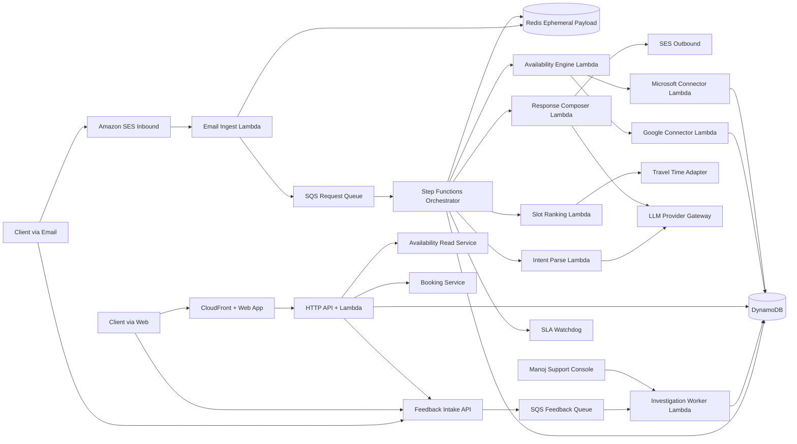

# Architecture and Design Specification

- Product: Intelligent Calendar Booking Agent
- Document Type: Technical Architecture and Design
- Version: v1.2 (Privacy, Scale, and Operability)
- Date: 2026-02-13
- Runtime Constraint: Node.js on AWS Lambda

## 1. Purpose
Define a production-ready architecture for a Node.js-based intelligent scheduling agent that:
1. Handles inbound scheduling conversations (MVP: email).
2. Aggregates availability from multiple Google and Microsoft calendars.
3. Recommends and books slots with timezone and travel constraints.
4. Exposes a serverless web interface for privacy-safe busy/free availability.
5. Uses GPT-5 by default while supporting future provider switching (Claude/Gemini) with minimal change.
6. Enforces zero retained email/calendar content after each scheduling task is complete.
7. Scales to thousands of clients with predictable latency and reliability.
8. Provides first-class debuggability and supportability for rapid root-cause analysis.

## 2. Architectural Principles
1. Deterministic core, probabilistic assistant:
LLM is used for language understanding and response composition, while scheduling decisions (availability checks, conflict checks, timezone math, policy enforcement) remain deterministic.
2. Channel-agnostic core:
Email and web use the same domain workflows through channel adapters.
3. Provider abstraction:
LLM provider and travel-time provider are swappable through explicit interfaces.
4. Privacy by default:
Busy/free is public-shareable by token, but meeting details are masked unless policy explicitly allows visibility.
5. Zero-retention content policy:
Email content and calendar content are processed transiently and purged at task completion.
6. Event-driven reliability:
Durable queues, idempotent handlers, retries, and DLQs for all asynchronous edges.
7. Serverless-first:
Managed AWS services for scale, security, and low-ops overhead.
8. Operability-first:
Every client-facing response must be traceable with correlation ids, decision-stage telemetry, and support workflows.
9. SLA-first responses:
Prefer full responses in seconds; always send answer, fallback, or escalation within 5 minutes.

## 3. Technology Choices (Node.js Stack)

| Concern | Selected Technology | Why This Choice |
|---|---|---|
| Language/runtime | TypeScript on Node.js 22 (Lambda) | Strong typing, broad ecosystem, first-class Lambda support |
| API entrypoint | API Gateway HTTP API + Lambda | Low latency, low operational complexity, native auth integration |
| Email ingestion | Amazon SES inbound -> Lambda | Direct processing path avoids persistent raw email storage |
| Orchestration | AWS Step Functions + Lambda tasks | Clear state transitions, retries, timeouts, and auditability for agent flows |
| Async decoupling | Amazon EventBridge + SQS | Loose coupling, resilient fan-out, replay-friendly integration |
| Primary datastore | Amazon DynamoDB | Persistent store for non-content metadata only |
| Ephemeral payload store | ElastiCache Serverless (Redis) | Encrypted, short-lived transient content with explicit delete on completion |
| Object store | Amazon S3 | Static web assets only |
| Web hosting | S3 + CloudFront | Serverless web delivery with caching and TLS |
| Secrets | AWS Secrets Manager + KMS | Secure token/provider secret management |
| Identity (web/admin) | Amazon Cognito (MVP admin); signed tokens for public availability links | Clear separation between authenticated admin and tokenized external access |
| Observability | AWS Powertools for TypeScript + CloudWatch + X-Ray | Structured logs/metrics/tracing with standard Lambda patterns |
| Alerting/incident ops | CloudWatch Alarms + SNS + PagerDuty/OpsGenie webhook | Fast incident detection and routed support escalation |
| Support investigation | Admin support UI + CloudWatch Logs Insights queries + Athena analytics views | Enables Manoj to investigate and classify root cause without raw content |
| Infra as code | AWS CDK (TypeScript) | Single-language stack across infra and app teams |
| Validation | Zod (request/event schemas) | Runtime validation + typed contracts |
| Timezone/date math | Luxon + IANA timezone IDs | Reliable timezone conversions and formatting |
| Calendar APIs | Google Calendar API + Microsoft Graph Calendar | Required for multi-provider aggregation |
| LLM default | GPT-5 through provider adapter | Product preference + high reasoning quality |

## 4. High-Level System Context

## 5. Component Architecture and Responsibilities

### 5.1 Channel Adapters

#### A. Email Adapter (MVP)
- Inbound path: SES receives mail -> triggers `EmailIngest` Lambda (no raw email persistence).
- Responsibilities:
1. Parse headers/body and normalize message payload.
2. Resolve conversation identity (thread id, sender, tenant).
3. Publish normalized scheduling request event.
4. Purge transient email payload immediately after task completion.
- Outbound path: `NotificationService` sends response via SES with thread continuity headers.

#### B. Web Adapter (MVP)
- Public availability view and booking request submission.
- Responsibilities:
1. Render busy/free schedule for permitted date range.
2. Enforce token-based access and org-level visibility policy.
3. Submit booking request to same scheduling domain APIs used by email path.

#### C. Future Adapters (v2)
- LinkedIn and SMS adapters must implement same normalized request contract.

### 5.2 Agent Orchestration Layer

#### A. Request Normalizer
- Converts channel-specific inputs into a single `SchedulingRequest` contract.
- Validates required fields and tags missing information for clarification prompts.

#### B. Conversation State Manager
- Persists state transitions: `received -> parsed -> proposed -> confirmed -> booked`.
- Stores content-free state only (ids, status, timestamps, policy outcomes).

#### C. Step Functions Orchestrator
- Coordinates deterministic workflow with explicit retries and compensation:
1. Parse intent and constraints.
2. Compute candidate availability.
3. Score/rank options.
4. Compose response.
5. Dispatch response or create booking.
- Runs with SLA watchdog checkpoints to enforce response deadlines.
- Workflow state payload contains opaque request references only (no email/calendar content fields).

### 5.3 Intelligence Layer

#### A. LLM Provider Gateway
- Internal interface for all model providers.
- Default adapter: GPT-5.
- Future adapters: Claude, Gemini.
- Responsibilities:
1. Structured extraction from unstructured text.
2. Natural language response drafting.
3. Clarification question generation.
- Guardrails:
1. JSON schema-constrained outputs.
2. Strict max token and timeout limits.
3. No direct tool permissions to write bookings without deterministic approval path.

#### B. Prompt and Policy Pack
- Versioned prompt templates for:
1. Intent extraction.
2. Slot explanation generation.
3. Clarification requests.
- Business policy context (advising days, preferred meeting durations, privacy constraints) injected by configuration service.

### 5.4 Scheduling Domain Services

#### A. Availability Aggregator
- Merges busy intervals across all connected calendars.
- Produces canonical free slot windows in UTC and local timezone views.
- Does not persist calendar event content beyond in-flight computation.

#### B. Constraint Engine
- Applies rules:
1. Advising day filter (default Tue/Wed, configurable).
2. Meeting length and buffer constraints.
3. Client-suggested windows and hard constraints.
4. Work-hours and blackout windows.

#### C. Timezone Engine
- Uses IANA timezone IDs.
- Converts and formats all suggestions for both host and client local times.

#### D. Travel-Time Engine
- For in-person requests:
1. Geocode destination.
2. Estimate travel to/from adjacent events.
3. Add required buffers and reject impossible options.
4. Prefer location clustering when multiple same-day meetings exist.

#### E. Slot Ranking Engine
- Scores candidates by:
1. Constraint satisfaction.
2. Travel efficiency.
3. Client preference fit.
4. Host preference fit.
- Returns top N suggestions with rationale metadata.

#### F. Booking Executor
- Creates events in target calendar account.
- Uses idempotency key per booking decision.
- Verifies slot still free immediately before final write.

### 5.5 Integration Services

#### A. Google Calendar Connector
- OAuth-based access.
- Reads free/busy and event metadata (policy-filtered).
- Writes confirmed bookings.
- Never persists event body/title/location/attendee content in durable storage.

#### B. Microsoft Graph Connector
- OAuth-based access.
- Reads free/busy and metadata.
- Writes confirmed bookings.
- Never persists event body/title/location/attendee content in durable storage.

#### C. Travel Provider Adapter
- Default provider abstraction for travel-time estimates (external API service configurable).

### 5.6 Policy and Privacy Service
- Evaluates visibility rules:
1. Default hide event details for public views.
2. Allow details only when event organization matches viewer policy.
3. Redact sensitive fields before response generation.
- Applies to API responses, prompt context sent to LLM, and persistence guards.

### 5.7 Notification Service
- Sends outbound email confirmations, alternatives, and clarification prompts.
- Maintains thread continuity via message headers.
- Includes client-visible response reference id for support/debug follow-up.

### 5.8 Admin and Configuration Service
- Stores/editable settings:
1. Advising days.
2. Default meeting durations.
3. Home timezone and location.
4. Calendar account priority and provider credentials.
5. Organization visibility policies.

### 5.9 Observability and Audit Service
- Structured logs with correlation IDs.
- Metrics per workflow stage.
- Immutable content-free audit records for booking decisions and policy checks.

### 5.10 Feedback Intake and Investigation Service
- Captures client-reported issues (for example: "response incorrect" or "response odd") from web and email channels.
- Responsibilities:
1. Validate and persist content-free feedback metadata (request id, channel, issue type, timestamp, reporter).
2. Trigger investigation workflow tied to original request correlation ids.
3. Run automated diagnostics (policy checks, provider errors, timeout/retry history, model version comparison).
4. Produce root-cause category and recommended action (auto-correct, retry, or manual review).

### 5.11 Support Console and Operational Runbooks
- Provides Manoj with searchable request timelines and investigation outcomes.
- Responsibilities:
1. Display end-to-end trace across intake, recommendation, booking, and notification stages.
2. Surface root-cause classification and confidence.
3. Support safe manual actions (resend response, trigger re-evaluation, escalate).
4. Link to runbooks for common incidents (latency breach, provider outage, malformed extraction).

## 6. Data Architecture

## 6.1 Primary Data Stores

| Store | Purpose | Retention |
|---|---|---|
| DynamoDB: `TenantConfig` | Host preferences, advising days, timezone/home location, policy toggles | Persistent |
| DynamoDB: `CalendarConnections` | OAuth metadata and provider account mapping (token references only) | Persistent |
| DynamoDB: `RequestState` | Content-free workflow state (`requestId`, status, correlation ids, error codes) | TTL 7 days |
| DynamoDB: `FeedbackReports` | Client issue reports linked to `requestId`/`responseId` and issue taxonomy | TTL 90 days |
| DynamoDB: `InvestigationCases` | Automated/manual root-cause analysis outcomes and remediation actions | TTL 180 days |
| DynamoDB: `DecisionTrace` | Content-free stage diagnostics (latency, provider result codes, policy outcomes, prompt/model version ids) | TTL 30 days |
| DynamoDB: `BookingLedger` | Content-free booking metadata (`requestId`, provider event id, idempotency key, outcome) | Persistent |
| DynamoDB: `PolicyRules` | Org visibility and privacy rules | Persistent |
| DynamoDB: `AuditLog` | Content-free security and business decision trail | 1-2 years (configurable) |
| Redis: `EphemeralPayload` | In-flight email parsing context and derived scheduling content | TTL <= 60 minutes + explicit delete on completion |
| S3: `web-app` | Static frontend assets | Versioned |

## 6.2 Data Modeling Standards
1. Use UTC for persisted timestamps; store timezone id separately when needed.
2. Use immutable event records for decision traceability.
3. Never store plaintext OAuth secrets in DynamoDB; store references to Secrets Manager keys.
4. Include `tenantId`, `requestId`, and `correlationId` on all records.
5. Never persist email body, attachment content, or full MIME payloads.
6. Never persist calendar event content (`title`, `description/body`, attendees, location notes).
7. Permit only content-free telemetry fields in logs and audit tables.
8. Every client response and feedback record must include a stable `responseId` and `correlationId`.

## 6.3 Purge and Retention Controls
1. Explicit purge step runs at workflow completion (`success`, `failed`, `cancelled`).
2. Redis key namespaces are per-request and deleted on completion.
3. TTL acts only as safety fallback; compliance relies on explicit purge, not TTL lag.
4. Daily compliance job verifies zero retained content records and emits exception alerts.
5. Step Functions execution input/output is restricted to ids and status metadata only.

## 7. API and Event Contracts

## 7.1 Public/External APIs (MVP)
1. `GET /v1/public/availability?token=...&start=...&end=...`
Purpose: return busy/free blocks with privacy masking.
2. `POST /v1/public/booking-requests`
Purpose: submit selected slot request from web page.
3. `GET /v1/public/booking-requests/{id}`
Purpose: booking status polling for UI.
4. `POST /v1/public/feedback`
Purpose: allow client to report a response as incorrect/odd and request review.

## 7.2 Admin APIs
1. `PUT /v1/admin/preferences`
2. `POST /v1/admin/calendar-connections/{provider}`
3. `PUT /v1/admin/policy-rules`
4. `GET /v1/admin/requests/{requestId}/trace`
5. `GET /v1/admin/investigations/{caseId}`
6. `POST /v1/admin/investigations/{caseId}/actions`

## 7.3 Internal Events
1. `scheduling.request.received`
2. `scheduling.request.parsed`
3. `scheduling.slots.generated`
4. `scheduling.response.sent`
5. `scheduling.booking.confirmed`
6. `scheduling.booking.failed`
7. `scheduling.response.sla_warning`
8. `scheduling.response.sla_breached`
9. `scheduling.feedback.received`
10. `scheduling.investigation.completed`

All events carry `eventId`, `tenantId`, `requestId`, `correlationId`, `occurredAt`, and schema version.
Events must not contain raw email text or calendar event content fields.

## 8. End-to-End Workflow Specifications

### 8.1 Email-Assisted Scheduling (MVP)
1. SES receives request email and invokes `EmailIngest` directly.
2. `EmailIngest` normalizes message, writes transient payload to Redis, and enqueues request id.
3. Step Functions workflow starts with `responseDeadlineAt` (absolute 5-minute SLA cutoff).
4. `Intent Parse` task extracts constraints (suggested slots, preference windows, modality, location) from transient payload.
5. `Availability` task queries Google/Microsoft live free/busy and computes in-memory windows (no durable calendar content cache).
6. `Constraint + Ranking` task generates top suggestions.
7. `Response Composer` drafts reply using structured recommendation output.
8. `SLAWatchdog` checks elapsed time and either:
   - dispatches full response when available, or
   - dispatches fallback/escalation response before 5 minutes.
9. `NotificationService` sends response via SES with `responseId`/`correlationId`.
10. `PurgeTask` deletes transient payloads and response artifacts; only content-free metadata remains.

### 8.2 Web Self-Serve Availability (MVP)
1. Client opens signed availability URL.
2. API validates token and policy context.
3. API retrieves availability windows for configured advising days.
4. API returns busy/free blocks; details masked unless org policy grants visibility.
5. Client submits preferred slot.
6. Booking request enters same orchestration path for final validation + booking.

### 8.3 Booking Confirmation Path
1. Re-check provider calendar free/busy for slot just before booking.
2. Execute booking with connector.
3. On success, persist content-free booking metadata and emit `scheduling.booking.confirmed`.
4. On conflict, emit failure event and trigger alternative suggestion response.

### 8.4 Client Feedback and Root-Cause Workflow
1. Client reports issue through web feedback action or email follow-up referencing response id.
2. `Feedback Intake` records content-free feedback metadata and emits `scheduling.feedback.received`.
3. `Investigation Worker` pulls request trace, timing diagnostics, provider outcomes, and policy decisions.
4. System classifies root cause category (for example: extraction ambiguity, provider timeout, policy mismatch, ranking defect, external API failure).
5. System recommends remediation (auto-correct response, retry, or manual intervention).
6. Manoj can review investigation case in support console and trigger corrective action.

## 9. LLM and Agent Design Details

## 9.1 LLM Interaction Boundaries
1. LLM can interpret text and generate human responses.
2. LLM cannot directly mutate schedule state.
3. Final slot feasibility and booking are deterministic service decisions.

## 9.2 Provider Abstraction Contract
The gateway exposes operations for:
1. `extractSchedulingIntent`
2. `generateClarification`
3. `composeRecommendationResponse`

Each operation requires:
1. Schema-bound output.
2. Provider-agnostic request envelope.
3. Standardized error codes/timeouts.

## 9.3 Model Routing Strategy
1. Default model: GPT-5 for all extraction/composition.
2. Fallback path: retry with same provider once, then deterministic fallback template response.
3. Future: provider selection by task class (e.g., extraction vs drafting) without changing domain services.

## 10. Security, Privacy, and Compliance
1. IAM least privilege per Lambda role and per external secret.
2. KMS encryption for DynamoDB, S3, and Secrets Manager data.
3. PII minimization and redaction before log writes and LLM context.
4. Signed and expiring public availability links.
5. CSRF + rate limiting on public booking endpoints.
6. Content-free audit logging for policy checks and booking actions.
7. Mandatory purge workflow for transient email/calendar content at task completion.
8. Automated policy checks block writes containing email/calendar content in durable stores.
9. Support/investigation access is RBAC-gated and fully audited.

## 11. Reliability and Failure Handling
1. SQS redrive policy + DLQ for ingestion failures.
2. Step Functions retries with exponential backoff for transient external API failures.
3. Circuit-breaker behavior for calendar provider outages (degraded mode response).
4. Idempotent booking execution using request/slot key.
5. Dead-letter replay tooling for operator recovery.
6. SLA watchdog timer enforces mandatory client response or escalation before 5 minutes.
7. Overload controls: queue backpressure, reserved concurrency, and prioritized processing for in-flight requests near SLA breach.

## 12. Performance and Scaling Targets
1. Scale target: support at least 10,000 client identities and 2,000 concurrent active scheduling workflows.
2. Ideal response target: few-second client experience (p95 <= 5 seconds for web/API interactions and immediate acknowledgement for email intake).
3. Standard full-response target: p95 <= 30 seconds for scheduling recommendations under normal load.
4. Hard response ceiling: 100% of client requests receive full, fallback, or escalation response within 5 minutes.
5. Queue SLO: p95 queue age <= 30 seconds, p99 <= 120 seconds.
6. Request-scoped in-memory/ephemeral caching only; no durable availability cache containing calendar content.
7. CloudFront caching for static UI and non-sensitive public assets.

## 13. Deployment Topology (AWS)
1. Separate stacks per environment: `dev`, `staging`, `prod`.
2. CDK deploy pipeline with gated promotion.
3. Environment-specific secrets and provider credentials.
4. Feature flags for provider switching and rollout of new channels.

## 14. Monitoring and Operations

### 14.1 Core Metrics
1. `request_intake_count`
2. `recommendation_latency_ms`
3. `booking_conflict_rate`
4. `provider_api_error_rate`
5. `llm_cost_per_request`
6. `manual_intervention_rate`
7. `response_sla_breach_count`
8. `feedback_reports_count`
9. `investigation_mttd_minutes`
10. `investigation_mttr_minutes`
11. `queue_age_seconds`
12. `concurrent_workflows`

### 14.2 Alerting
1. High booking failure rate.
2. High queue age.
3. Elevated LLM timeout/error ratio.
4. Policy enforcement failures.
5. Any 5-minute response SLA breach.
6. Sustained investigation backlog growth.

### 14.3 Dashboards
1. Scheduling funnel (received -> suggested -> confirmed -> booked).
2. By-channel throughput.
3. By-provider latency and failure trends.
4. Response SLA dashboard (`p50/p95/p99`, breaches, fallback rate).
5. Debug/support dashboard (feedback volume, root-cause categories, MTTD/MTTR).

### 14.4 Supportability Design
1. Every client response includes a support reference id tied to `requestId` and `correlationId`.
2. Support console provides one-click trace view across workflow stages and dependencies.
3. Standard root-cause taxonomy is required for every closed investigation case.
4. Runbooks define triage and remediation steps for top failure modes.

## 15. Extensibility Blueprint
1. New channel integration:
Implement adapter -> emit normalized request -> reuse orchestration unchanged.
2. New LLM provider:
Implement provider gateway adapter and config mapping.
3. New calendar provider:
Implement connector interface and register in aggregator.
4. Advanced optimization:
Swap ranking strategy implementation without channel/API changes.

## 16. Release Phasing (Design-Oriented)
1. Phase 1: Email + unified availability + recommendation + booking.
2. Phase 2: Public web busy/free + booking request + policy visibility.
3. Phase 3: Improved travel clustering and richer preference learning.
4. Phase 4: LinkedIn/SMS channels and advanced analytics.

## 17. Open Design Decisions
1. Final travel-time provider selection (cost/accuracy tradeoff).
2. Organization identity assertion strategy for details visibility.
3. Compliance SLO for purge completion latency (for example: <= 60 seconds after workflow end).
4. Human-in-the-loop override UX for edge-case conflicts.
5. Load test profile and traffic-shaping assumptions for peak bursts.
6. Long-term ownership model for on-call support and incident operations.
